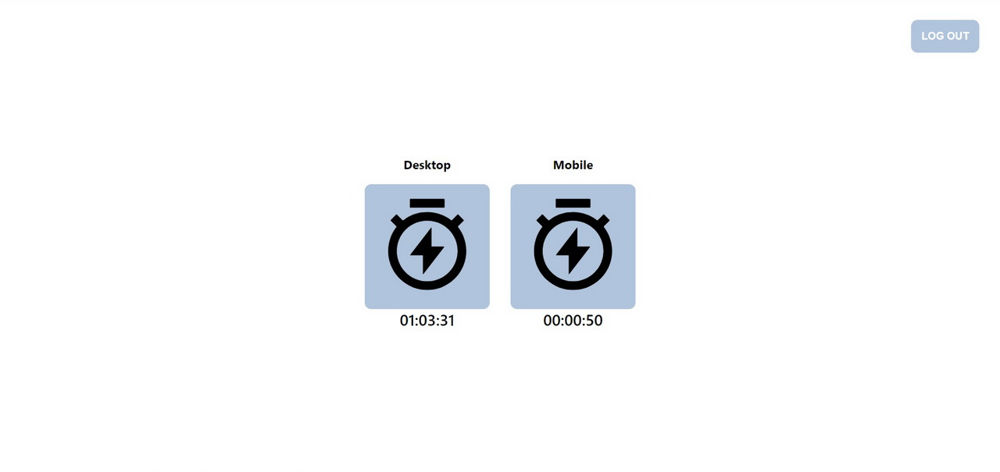

## Signin counter
React/Firebase app for counting total time the user is online. Depending on the device the user uses, Desktop or Mobile timer launches.

### Libraries and dependencies used

- [React](https://reactjs.org/)
- [Hooks API](https://reactjs.org/docs/hooks-intro.html)
- [Firebase](https://firebase.google.com/)